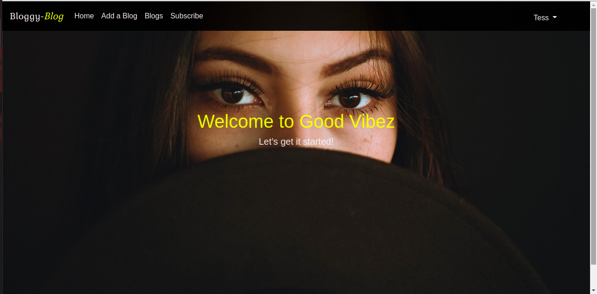
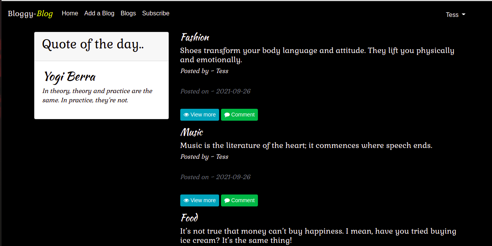

## BLOGGY-BLOG
### AUTHOR;
 #### Teresia King'ori.

### Project Description
#### ***A blog website where you can create and share your blogs and other users can read and comment on them***

### Setup Requirements
    - Git
    - Github
    - Code Editor
    - Web Browser

### Setup Installation 
    - Fork app from github
    - Clone the app in your terminal using $git clone command
    - Run the code in your code editor  using :
    $ chmod a+x start.py
    $ ./start.sh command

#### Technologies Used;
    - HTML
    - CSS
    - Python
    -Flask
    -Bootstrap
    -PostgreSQL

## Known Bugs

So far so good there are no bugs related to this project     

### LICENCE
____

## Screenshots

#### Email :kingoriteresia@gmail.com
#### &copy;2021 Teresia King'ori.